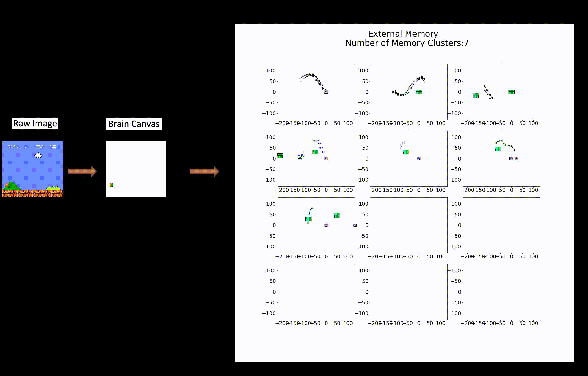

# procedural-memory-augmented-RL
This is the code for paper procedural memory augmented RL. Here the object detector is already learned and saved in folder templates. 
The a well trained trajectory RL is stored in folder training_result. The trained model can be trained with the code in my another Github repository https://github.com/YINGMAgator/Supermario_seq. 

To run the code, 
step1 create the dual memory, run script dual_detector_creat.py, this will generate Dual_Memory.pickle and figure_patch.pickle.
step2 test the performance, run script model_test_dualmemory.py, this will load Dual_Memory.pickle and figure_patch.pickle and make decision 
      with either the dual memory or trajectory RL.
      

  

      
